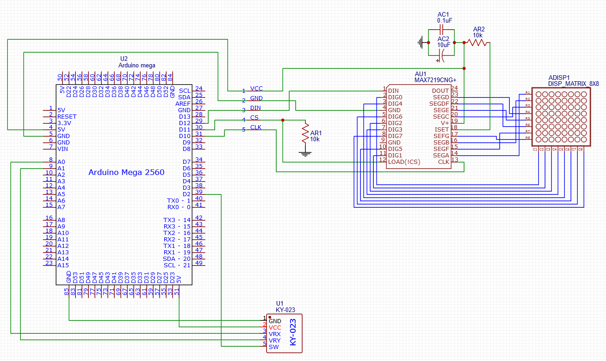

# sketchbook
Random arduino projects.

## etch-a-sketch
This sketch lets you use an analog joystick module (KY-023 or similar; anything with voltage proportional to X/Y pins and a switch for clicking) to 'draw' on an LED matrix controlled by a MAX72XX IC. Only supports a single matrix at this time. Clicking the joystick clears the display.
